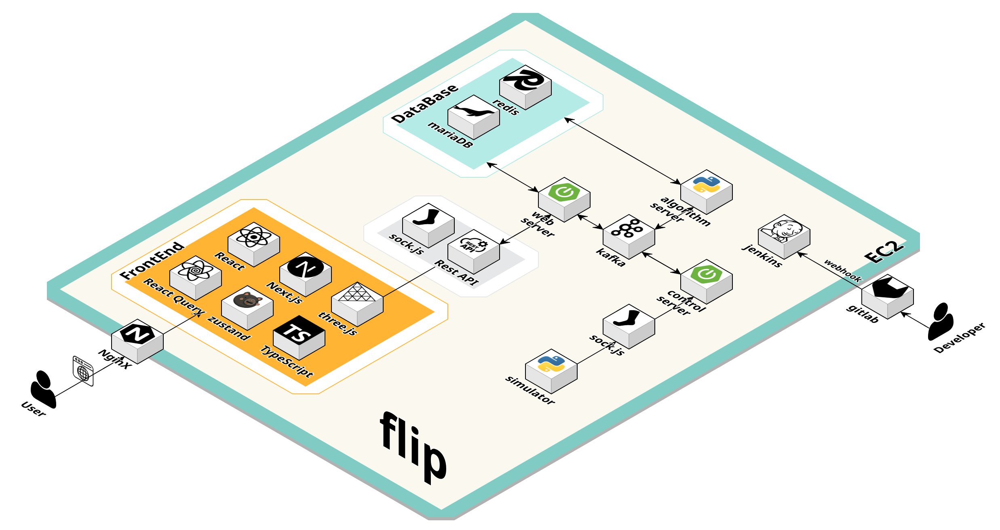

<!-- 메인 이미지? -->
<!-- <br /> -->

# FLIP(Factory Logistics Intelligent Platform)

## 📌 목차

1. [프로젝트 소개](#-프로젝트-소개)
2. [주요 기능](#-주요-기능)
3. [기술 아키텍처](#-기술-아키텍처처)
4. [기술 스택](#-주요-기술)
5. [산출물](#-산출물)
6. [팀 소개](#-팀-소개)
   <br />

## 🚀 프로젝트 소개

**SSAFY 12기 2학기 자율 프로젝트 (삼성전자 연계 프로젝트)**

> ⌛ 프로젝트 기간 : 2025.04.14 ~ 2025.05.21 (6주)

> 🏠 [배포 URL](https://samsung-smartfactory.co.kr/)

<!-- > 📝 [발표 자료](수정 바람!) -->

**✨ 스마트 팩토리 관제 시스템**<br />
삼성전자 스마트 팩토리 내 설비 자동화가 고도화됨에 따라 제품 생산에 필요한 자재 및 완성된 제품의 이동(물류) 또한 점차 자동화하는 추세이다.  
이런 상황에서 여러 종류의 물류 상황을 통합 관제하고 다양한 제조사의 자율 주행 로봇들을 통합 제어할 수 있는 시스템이 필요하다.

**💪 시스템 목표**<br />
현재 스마트 팩토리 내에서 운용중인 고정형/이동형 물류 기기의 실시간 상태 메시지를 수신하여 Web 화면에 실시간 모니터링 기능을 제공한다.  
또한 이 메시지를 처리하여 DB에 저장하고 이를 기반으로 최적 물류 작업 배치 알고리즘을 개발한다.

## 🚀 주요 기능

<strong>실시간 관제</strong>


<strong>경로 이동</strong>


## 🗺️ 기술 아키텍처



## 🚀 프론트엔드 기술 스택

<details>
<summary><strong>펼치기</strong>
</summary>

### `Next.js`

React 기반의 프레임워크, 서버 사이드 렌더링(SSR)을 활용하여 성능 최적화.

### `TypeScript`

코드의 안정성 및 유지 보수성을 높이는 강력한 타입 시스템 제공

### `React-Three-fiber/drei`

three js를 React 생태계에서 재사용 가능하고 독립적인 구성 요소를 사용하여 선언적으로 개발할 수 있는 라이브러리.

### `React-query`

서버 상태 관리를 위한 라이브러리로, 데이터 페칭, 캐싱, 동기화, 업데이트를 간편하고 효율적으로 처리.

### `Zustand`

간단하고 가벼운 클라이언트 상태 관리 라이브러리로, 실시간 데이터의 복잡한 상태를 관리.

### `TailwindCSS`

유틸리티 클래스 기반 CSS 프레임워크로, 빠르고 일관된 UI 개발에 활용.

### `Shadcn`

전체 라이브러리를 종속성으로 설치하는 대신 필요한 컴포넌트만 선택적으로 프로젝트에 직접 커스터마이징 및 적용에 활용

</details>

## 🔧 백엔드 기술 스택

<details>
  <summary><strong>펼치기</strong></summary>

### ☕ Java 17

최신 LTS 버전의 Java를 기반으로, 높은 성능과 안정성을 갖춘 백엔드 애플리케이션 구현에 활용.  
Record, Switch Expression 등의 현대적인 문법을 통해 코드 가독성과 개발 생산성 향상.

### 🚀 Spring Boot 3.4.3

REST API, 스케줄링, 예외 처리, 검증 등의 기능을 빠르고 효율적으로 구현할 수 있도록 지원하는 프레임워크.  
프로젝트 구조와 의존성 관리를 표준화하여 유지보수성 향상.

### 🔐 Spring Security

JWT 기반의 인증 및 인가를 위해 커스텀 필터(`CustomAuthenticationFilter`)와 사용자 정의 토큰(`CustomAuthToken`)을 활용하여 보안 처리 구현.

### 🧩 Spring Data JPA

객체지향적인 방식으로 DB에 접근하며, 복잡한 쿼리도 메서드 정의만으로 간편하게 처리.

### 🗄️ MySQL

대중적이고 안정적인 관계형 데이터베이스.  
다양한 인덱스 전략과 트랜잭션 기능을 활용하여 데이터 정합성과 성능을 확보.  
테이블 간 관계(ERD)를 기반으로 유저-식당-메뉴 간의 구조적 설계 구성.

### ⚡ Redis

인증 토큰, 알림 캐시, 인기 맛집 데이터 등의 임시 저장소로 활용.  
빠른 읽기/쓰기 속도를 바탕으로 실시간 사용자 경험 개선.

### 🗂️ AWS S3

사용자 커스텀 메뉴 이미지 및 식당 이미지 저장소로 사용.  
`Pre-signed URL`을 통해 보안성을 확보하며, 대용량 정적 파일 업로드/다운로드 처리에 활용.

### 📦 Docker

로컬 개발 환경과 배포 환경의 일관성을 확보하기 위해 모든 구성 요소를 컨테이너화하여 관리.

### 🔁 Jenkins

GitLab 연동을 통해 자동화된 CI/CD 파이프라인을 구축.  
코드 커밋 시 자동 빌드 및 배포를 통해 개발 효율성과 안정성 강화.

### 🌐 Nginx

정적 리소스 제공 및 리버스 프록시 서버로 활용.  
API 요청 라우팅, SSL 인증서 설정, 로드밸런싱 등 웹 서버 최적화 구성에 기여.

## 폴더 구조
<details>
  <summary><strong>펼치기</strong></summary>
  # 📁 BE.zip - 전체 폴더 및 파일 구조

  ```
  BE_extracted/
      algorithm/
          .gitignore
          AlgorithmServer.py
          api.py
          Dockerfile
          edge.txt
          requirements.txt
          test.py
          ╕╩╡Ñ└╠┼═.txt
          __pycache__/
              api.cpython-311.pyc
              api.cpython-313.pyc
              api2.cpython-313.pyc
      flip/
          .gitattributes
          .gitignore
          build.gradle
          Dockerfile
          gradlew
          gradlew.bat
          settings.gradle
          .gradle/
              file-system.probe
              8.13/
                  gc.properties
                  checksums/
                      checksums.lock
                  executionHistory/
                      executionHistory.bin
                      executionHistory.lock
                  expanded/
                  fileChanges/
                      last-build.bin
                  fileHashes/
                      fileHashes.bin
                      fileHashes.lock
                      resourceHashesCache.bin
                  vcsMetadata/
              buildOutputCleanup/
                  buildOutputCleanup.lock
                  cache.properties
                  outputFiles.bin
              nb-cache/
                  subprojects.ser
                  flip-200108262/
                      project-info.ser
                  trust/
                      0BC8B0D2DCB41642BB208D3C3025C2E7938D25BBBC0A44115FFD1177D0F175EA
              vcs-1/
                  gc.properties
          .idea/
              compiler.xml
              gradle.xml
              misc.xml
              modules.xml
              vcs.xml
              workspace.xml
              modules/
                  flip.main.iml
          bin/
              default/
              generated-sources/
                  annotations/
              generated-test-sources/
                  annotations/
              main/
                  application.properties
                  com/
                      ssafy/
                          flip/
                              FlipApplication.class
                              domain/
                                  amr/
                                      controller/
                                          AmrController.class
                                      dto/
                                          request/
                                              .gitkeep
                                          response/
                                              .gitkeep
                                      entity/
                                          AMR$AMRBuilder.class
                                          AMR.class
                                      repository/
                                          AmrJpaRepository.class
                                          AmrRepository.class
                                          AmrRepositoryImpl.class
                                      service/
                                          AmrService.class
                                          AmrServiceImpl.class
                                  connect/
                                      config/
                                          AsyncConfig.class
                                      controller/
                                          ConnectController.class
                                      dto/
                                          request/
                                              AmrMissionDTO.class
                                              RouteTempDTO$RouteTempDTOBuilder.class
                                              RouteTempDTO.class
                                          response/
                                              EdgeDTO.class
                                              MapInfoDTO$Areas.class
                                              MapInfoDTO$Body.class
                                              MapInfoDTO$Header.class
                                              MapInfoDTO$MapData.class
                                              MapInfoDTO.class
                                              MissionAssignDTO$Body.class
                                              MissionAssignDTO$Header.class
                                              MissionAssignDTO$SubmissionDTO.class
                                              MissionAssignDTO.class
                                              MissionCancelDTO$Body.class
                                              MissionCancelDTO$Header.class
                                              MissionCancelDTO.class
                                              NodeDTO.class
                                              TrafficPermitDTO$Body.class
                                              TrafficPermitDTO$Header.class
                                              TrafficPermitDTO.class
                                      handler/
                                          AmrWebSocketHandler.class
                                      service/
                                          AlgorithmResultConsumer.class
                                          AlgorithmTriggerProducer.class
                                          ConnectService.class
                                          ConnectServiceImpl$1.class
                                          ConnectServiceImpl.class
                                          WebSocketService.class
                                          WebSocketServiceImpl.class
                                          WebTriggerProducer.class
                                  line/
                                      entity/
                                          Line$LineBuilder.class
                                          Line.class
                                      repository/
                                          LineJpaRepository.class
                                          LineRepository.class
                                          LineRepositoryImpl.class
                                      service/
                                          LineService.class
                                          LineServiceImpl.class
                                  log/
                                      controller/
                                          ErrorLogController.class
                                          MissionLogController.class
                                      dto/
                                          error/
                                              request/
                                                  AddErrorRequestDTO.class
                                              response/
                                                  .gitkeep
                                          mission/
                                              request/
                                                  AddMissionLogRequestDTO.class
                                              response/
                                                  .gitkeep
                                          route/
                                              request/
                                                  AddRouteRequestDTO.class
                                              response/
                                                  .gitkeep
                                      entity/
                                          ErrorLog$ErrorLogBuilder.class
                                          ErrorLog.class
                                          MissionLog$MissionLogBuilder.class
                                          MissionLog.class
                                          Route$RouteBuilder.class
                                          Route.class
                                      repository/
                                          error/
                                              ErrorLogJpaRepository.class
                                              ErrorLogRepository.class
                                              ErrorLogRepositoryImpl.class
                                          mission/
                                              MissionLogJpaRepository.class
                                              MissionLogRepository.class
                                              MissionLogRepositoryImpl.class
                                          route/
                                              RouteJpaRepository.class
                                              RouteRepository.class
                                              RouteRepositoryImpl.class
                                      service/
                                          error/
                                              ErrorLogService.class
                                              ErrorLogServiceImpl.class
                                          mission/
                                              MissionLogService.class
                                              MissionLogServiceImpl.class
                                          route/
                                              RouteService.class
                                              RouteServiceImpl.class
                                  mission/
                                      dto/
                                          MissionResponse.class
                                      entity/
                                          Mission$MissionBuilder.class
                                          Mission.class
                                      repository/
                                          MissionJpaRepository.class
                                          MissionRepository.class
                                          MissionRepositoryImpl.class
                                      service/
                                          MissionService.class
                                          MissionServiceImpl.class
                                      vo/
                                          MissionType.class
                                  node/
                                      entity/
                                          Edge$EdgeBuilder.class
                                          Edge.class
                                          Node$NodeBuilder.class
                                          Node.class
                                          VirtualWall$VirtualWallBuilder.class
                                          VirtualWall.class
                                      repository/
                                          edge/
                                              EdgeJpaRepository.class
                                              EdgeRepository.class
                                              EdgeRepositoryImpl.class
                                          node/
                                              NodeJpaRepository.class
                                              NodeRepository.class
                                              NodeRepositoryImpl.class
                                      service/
                                          edge/
                                              EdgeService.class
                                              EdgeServiceImpl.class
                                          node/
                                              NodeService.class
                                              NodeServiceImpl.class
                                      vo/
                                          EdgeDirection.class
                                          NodeType.class
                                  status/
                                      controller/
                                          StatusController.class
                                      dto/
                                          request/
                                              AmrSaveRequestDTO$Body.class
                                              AmrSaveRequestDTO$Header.class
                                              AmrSaveRequestDTO.class
                                              AmrUpdateRequestDTO.class
                                              LineSaveRequestDTO.class
                                              MissionRequestDto$Body.class
                                              MissionRequestDto$Header.class
                                              MissionRequestDto$Routes.class
                                              MissionRequestDto.class
                                      entity/
                                          AmrStatusRedis$AmrStatusRedisBuilder.class
                                          AmrStatusRedis.class
                                          LineStatusRedis$LineStatusRedisBuilder.class
                                          LineStatusRedis.class
                                      repository/
                                          AmrStatusRedisRepository.class
                                      service/
                                          StatusService.class
                                          StatusServiceImpl.class
                                  storage/
                                      entity/
                                          Storage$StorageBuilder.class
                                          Storage.class
                              global/
                                  config/
                                      KafkaConsumerConfig.class
                                      RedisConfig.class
                                      WebSocketConfig.class
                                  init/
                                      AmrRedisInitializer.class
                                      JacksonModuleInitializer.class
              test/
                  com/
                      ssafy/
                          flip/
                              FlipApplicationTests.class
          build/
              classes/
                  java/
                      main/
                          com/
                              ssafy/
                                  flip/
                                      FlipApplication.class
                                      domain/
                                          amr/
                                              controller/
                                                  AmrController.class
                                              entity/
                                                  AMR$AMRBuilder.class
                                                  AMR.class
                                              repository/
                                                  AmrJpaRepository.class
                                                  AmrRepository.class
                                                  AmrRepositoryImpl.class
                                              service/
                                                  AmrService.class
                                                  AmrServiceImpl.class
                                          connect/
                                              config/
                                                  AsyncConfig.class
                                              controller/
                                                  ConnectController.class
                                              dto/
                                                  request/
                                                      AmrMissionDTO.class
                                                      HumanSaveRequestDTO$Body.class
                                                      HumanSaveRequestDTO$Header.class
                                                      HumanSaveRequestDTO.class
                                                      HumanStartRequestDTO$Body.class
                                                      HumanStartRequestDTO$Header.class
                                                      HumanStartRequestDTO.class
                                                      MissionResultWrapper.class
                                                      RouteTempDTO$RouteTempDTOBuilder.class
                                                      RouteTempDTO.class
                                                  response/
                                                      EdgeDTO.class
                                                      MapInfoDTO$Areas.class
                                                      MapInfoDTO$Body.class
                                                      MapInfoDTO$Header.class
                                                      MapInfoDTO$MapData.class
                                                      MapInfoDTO.class
                                                      MissionAssignDTO$Body.class
                                                      MissionAssignDTO$Header.class
                                                      MissionAssignDTO$SubmissionDTO.class
                                                      MissionAssignDTO.class
                                                      MissionCancelDTO$Body.class
                                                      MissionCancelDTO$Header.class
                                                      MissionCancelDTO.class
                                                      NodeDTO.class
                                                      TrafficPermitDTO$Body.class
                                                      TrafficPermitDTO$Header.class
                                                      TrafficPermitDTO.class
                                              handler/
                                                  AmrWebSocketHandler.class
                                                  HumanWebSocketHandler.class
                                              service/
                                                  AlgorithmResultConsumer.class
                                                  AlgorithmTriggerProducer.class
                                                  ConnectService.class
                                                  ConnectServiceImpl$1.class
                                                  ConnectServiceImpl.class
                                                  HumanWebSocketService.class
                                                  HumanWebSocketServiceImpl.class
                                                  WebSocketService.class
                                                  WebSocketServiceImpl.class
                                                  WebTriggerProducer.class
                                          line/
                                              entity/
                                                  Line$LineBuilder.class
                                                  Line.class
                                              repository/
                                                  LineJpaRepository.class
                                                  LineRepository.class
                                                  LineRepositoryImpl.class
                                              service/
                                                  LineService.class
                                                  LineServiceImpl.class
                                          log/
                                              controller/
                                                  ErrorLogController.class
                                                  MissionLogController.class
                                              dto/
                                                  error/
                                                      request/
                                                          AddErrorRequestDTO.class
                                                  mission/
                                                      request/
                                                          AddMissionLogRequestDTO.class
                                                  route/
                                                      request/
                                                          AddRouteRequestDTO.class
                                              entity/
                                                  ErrorLog$ErrorLogBuilder.class
                                                  ErrorLog.class
                                                  MissionLog$MissionLogBuilder.class
                                                  MissionLog.class
                                                  Route$RouteBuilder.class
                                                  Route.class
                                              repository/
                                                  error/
                                                      ErrorLogJpaRepository.class
                                                      ErrorLogRepository.class
                                                      ErrorLogRepositoryImpl.class
                                                  mission/
                                                      MissionLogJpaRepository.class
                                                      MissionLogRepository.class
                                                      MissionLogRepositoryImpl.class
                                                  route/
                                                      RouteJpaRepository.class
                                                      RouteRepository.class
                                                      RouteRepositoryImpl.class
                                              service/
                                                  error/
                                                      ErrorLogService.class
                                                      ErrorLogServiceImpl.class
                                                  mission/
                                                      MissionLogService.class
                                                      MissionLogServiceImpl.class
                                                  route/
                                                      RouteService.class
                                                      RouteServiceImpl.class
                                          mission/
                                              dto/
                                                  MissionResponse.class
                                              entity/
                                                  Mission$MissionBuilder.class
                                                  Mission.class
                                              repository/
                                                  MissionJpaRepository.class
                                                  MissionRepository.class
                                                  MissionRepositoryImpl.class
                                              service/
                                                  MissionService.class
                                                  MissionServiceImpl.class
                                              vo/
                                                  MissionType.class
                                          node/
                                              entity/
                                                  Edge$EdgeBuilder.class
                                                  Edge.class
                                                  Node$NodeBuilder.class
                                                  Node.class
                                                  VirtualWall$VirtualWallBuilder.class
                                                  VirtualWall.class
                                              repository/
                                                  edge/
                                                      EdgeJpaRepository.class
                                                      EdgeRepository.class
                                                      EdgeRepositoryImpl.class
                                                  node/
                                                      NodeJpaRepository.class
                                                      NodeRepository.class
                                                      NodeRepositoryImpl.class
                                              service/
                                                  edge/
                                                      EdgeService.class
                                                      EdgeServiceImpl.class
                                                  node/
                                                      NodeService.class
                                                      NodeServiceImpl.class
                                              vo/
                                                  EdgeDirection.class
                                                  NodeType.class
                                          status/
                                              controller/
                                                  StatusController.class
                                              dto/
                                                  request/
                                                      AmrSaveRequestDTO$Body.class
                                                      AmrSaveRequestDTO$Header.class
                                                      AmrSaveRequestDTO.class
                                                      AmrUpdateRequestDTO.class
                                                      LineSaveRequestDTO.class
                                                      MissionRequestDto$Body.class
                                                      MissionRequestDto$Header.class
                                                      MissionRequestDto$Routes.class
                                                      MissionRequestDto.class
                                              entity/
                                                  AmrStatusRedis$AmrStatusRedisBuilder.class
                                                  AmrStatusRedis.class
                                                  LineStatusRedis$LineStatusRedisBuilder.class
                                                  LineStatusRedis.class
                                              repository/
                                                  AmrStatusRedisRepository.class
                                              service/
                                                  StatusService.class
                                                  StatusServiceImpl.class
                                          storage/
                                              entity/
                                                  Storage$StorageBuilder.class
                                                  Storage.class
                                      global/
                                          config/
                                              KafkaConsumerConfig.class
                                              RedisConfig.class
                                              WebSocketConfig.class
                                          init/
                                              AmrRedisInitializer.class
                                              JacksonModuleInitializer.class
              generated/
                  sources/
                      annotationProcessor/
                          java/
                              main/
                      headers/
                          java/
                              main/
              reports/
                  problems/
                      problems-report.html
              resources/
                  main/
                      application.properties
              tmp/
                  artifactTransforms/
                  assemble/
                  bootBuildImage/
                  bootJar/
                      MANIFEST.MF
                  bootRun/
                  bootTestRun/
                  build/
                  buildDependents/
                  buildEnvironment/
                  buildNeeded/
                  check/
                  classes/
                  clean/
                  compileJava/
                      previous-compilation-data.bin
                      compileTransaction/
                          backup-dir/
                          stash-dir/
                              WebSocketServiceImpl.class.uniqueId0
                  compileTestJava/
                  components/
                  dependencies/
                  dependencyInsight/
                  dependencyManagement/
                  dependentComponents/
                  help/
                  init/
                  jar/
                      MANIFEST.MF
                  javadoc/
                  javaToolchains/
                  model/
                  outgoingVariants/
                  prepareKotlinBuildScriptModel/
                  processResources/
                  processTestResources/
                  projects/
                  properties/
                  resolvableConfigurations/
                  resolveMainClassName/
                  resolveTestMainClassName/
                  runSingle/
                  tasks/
                  test/
                  testClasses/
                  updateDaemonJvm/
                  wrapper/
          gradle/
              wrapper/
                  gradle-wrapper.jar
                  gradle-wrapper.properties
          src/
              main/
                  java/
                      com/
                          ssafy/
                              flip/
                                  FlipApplication.java
                                  domain/
                                      amr/
                                          controller/
                                              AmrController.java
                                          dto/
                                              request/
                                                  .gitkeep
                                              response/
                                                  .gitkeep
                                          entity/
                                              AMR.java
                                          repository/
                                              AmrJpaRepository.java
                                              AmrRepository.java
                                              AmrRepositoryImpl.java
                                          service/
                                              AmrService.java
                                              AmrServiceImpl.java
                                      connect/
                                          config/
                                              AsyncConfig.java
                                          controller/
                                              ConnectController.java
                                          dto/
                                              request/
                                                  AmrMissionDTO.java
                                                  HumanSaveRequestDTO.java
                                                  HumanStartRequestDTO.java
                                                  MissionResultWrapper.java
                                                  RouteTempDTO.java
                                              response/
                                                  EdgeDTO.java
                                                  MapInfoDTO.java
                                                  MissionAssignDTO.java
                                                  MissionCancelDTO.java
                                                  NodeDTO.java
                                                  TrafficPermitDTO.java
                                          handler/
                                              AmrWebSocketHandler.java
                                              HumanWebSocketHandler.java
                                          service/
                                              AlgorithmResultConsumer.java
                                              AlgorithmTriggerProducer.java
                                              ConnectService.java
                                              ConnectServiceImpl.java
                                              HumanWebSocketService.java
                                              HumanWebSocketServiceImpl.java
                                              WebSocketService.java
                                              WebSocketServiceImpl.java
                                              WebTriggerProducer.java
                                      line/
                                          entity/
                                              Line.java
                                          repository/
                                              LineJpaRepository.java
                                              LineRepository.java
                                              LineRepositoryImpl.java
                                          service/
                                              LineService.java
                                              LineServiceImpl.java
                                      log/
                                          controller/
                                              ErrorLogController.java
                                              MissionLogController.java
                                          dto/
                                              error/
                                                  request/
                                                      AddErrorRequestDTO.java
                                                  response/
                                                      .gitkeep
                                              mission/
                                                  request/
                                                      AddMissionLogRequestDTO.java
                                                  response/
                                                      .gitkeep
                                              route/
                                                  request/
                                                      AddRouteRequestDTO.java
                                                  response/
                                                      .gitkeep
                                          entity/
                                              ErrorLog.java
                                              MissionLog.java
                                              Route.java
                                          repository/
                                              error/
                                                  ErrorLogJpaRepository.java
                                                  ErrorLogRepository.java
                                                  ErrorLogRepositoryImpl.java
                                              mission/
                                                  MissionLogJpaRepository.java
                                                  MissionLogRepository.java
                                                  MissionLogRepositoryImpl.java
                                              route/
                                                  RouteJpaRepository.java
                                                  RouteRepository.java
                                                  RouteRepositoryImpl.java
                                          service/
                                              error/
                                                  ErrorLogService.java
                                                  ErrorLogServiceImpl.java
                                              mission/
                                                  MissionLogService.java
                                                  MissionLogServiceImpl.java
                                              route/
                                                  RouteService.java
                                                  RouteServiceImpl.java
                                      mission/
                                          dto/
                                              MissionResponse.java
                                          entity/
                                              Mission.java
                                          repository/
                                              MissionJpaRepository.java
                                              MissionRepository.java
                                              MissionRepositoryImpl.java
                                          service/
                                              MissionService.java
                                              MissionServiceImpl.java
                                          vo/
                                              MissionType.java
                                      node/
                                          entity/
                                              Edge.java
                                              Node.java
                                              VirtualWall.java
                                          repository/
                                              edge/
                                                  EdgeJpaRepository.java
                                                  EdgeRepository.java
                                                  EdgeRepositoryImpl.java
                                              node/
                                                  NodeJpaRepository.java
                                                  NodeRepository.java
                                                  NodeRepositoryImpl.java
                                          service/
                                              edge/
                                                  EdgeService.java
                                                  EdgeServiceImpl.java
                                              node/
                                                  NodeService.java
                                                  NodeServiceImpl.java
                                          vo/
                                              EdgeDirection.java
                                              NodeType.java
                                      status/
                                          controller/
                                              StatusController.java
                                          dto/
                                              request/
                                                  AmrSaveRequestDTO.java
                                                  AmrUpdateRequestDTO.java
                                                  LineSaveRequestDTO.java
                                                  MissionRequestDto.java
                                          entity/
                                              AmrStatusRedis.java
                                              LineStatusRedis.java
                                          repository/
                                              AmrStatusRedisRepository.java
                                          service/
                                              StatusService.java
                                              StatusServiceImpl.java
                                      storage/
                                          entity/
                                              Storage.java
                                  global/
                                      config/
                                          KafkaConsumerConfig.java
                                          RedisConfig.java
                                          WebSocketConfig.java
                                      init/
                                          AmrRedisInitializer.java
                                          JacksonModuleInitializer.java
                  resources/
                      application.properties
              test/
                  java/
                      com/
                          ssafy/
                              flip/
                                  FlipApplicationTests.java
      flip_web/
          .gitattributes
          .gitignore
          build.gradle
          Dockerfile
          gradlew
          gradlew.bat
          settings.gradle
          .gradle/
              file-system.probe
              8.13/
                  gc.properties
                  checksums/
                      checksums.lock
                      sha1-checksums.bin
                  executionHistory/
                      executionHistory.bin
                      executionHistory.lock
                  expanded/
                  fileChanges/
                      last-build.bin
                  fileHashes/
                      fileHashes.bin
                      fileHashes.lock
                      resourceHashesCache.bin
                  vcsMetadata/
              buildOutputCleanup/
                  buildOutputCleanup.lock
                  cache.properties
                  outputFiles.bin
              nb-cache/
                  subprojects.ser
                  flip_web-332365947/
                      project-info.ser
                  trust/
                      5A18A176E7E478B1CA66DC6FEE806579302F58704C4C28F6088384F7C1A58761
              vcs-1/
                  gc.properties
          .idea/
              .gitignore
              .name
              compiler.xml
              gradle.xml
              misc.xml
              vcs.xml
              workspace.xml
          bin/
              main/
                  application.properties
                  data.sql
                  com/
                      ssafy/
                          flip/
                              FlipApplication.class
                              domain/
                                  amr/
                                      entity/
                                          AMR$AMRBuilder.class
                                          AMR.class
                                      repository/
                                          AmrJpaRepository.class
                                          AmrRepository.class
                                          AmrRepositoryImpl.class
                                      service/
                                          AmrService.class
                                          AmrServiceImpl.class
                                  line/
                                      entity/
                                          Line$LineBuilder.class
                                          Line.class
                                      repository/
                                          LineJpaRepository.class
                                          LineRepository.class
                                          LineRepositoryImpl.class
                                      service/
                                          LineService.class
                                          LineServiceImpl.class
                                  log/
                                      entity/
                                          ErrorLog$ErrorLogBuilder.class
                                          ErrorLog.class
                                          MissionLog$MissionLogBuilder.class
                                          MissionLog.class
                                          Route$RouteBuilder.class
                                          Route.class
                                      repository/
                                          edge/
                                              RouteJpaRepository.class
                                              RouteRepository.class
                                              RouteRepositoryImpl.class
                                          missionlog/
                                              MissionLogJpaRepository.class
                                              MissionLogRepository.class
                                              MissionLogRepositoryImpl.class
                                      service/
                                          edge/
                                              RouteService.class
                                              RouteServiceImpl.class
                                          missionlog/
                                              MissionLogService.class
                                              MissionLogServiceImpl.class
                                  mission/
                                      entity/
                                          Mission$MissionBuilder.class
                                          Mission.class
                                      vo/
                                          MissionType.class
                                  node/
                                      entity/
                                          Edge$EdgeBuilder.class
                                          Edge.class
                                          Node$NodeBuilder.class
                                          Node.class
                                          VirtualWall$VirtualWallBuilder.class
                                          VirtualWall.class
                                      repository/
                                          edge/
                                              EdgeJpaRepository.class
                                              EdgeRepository.class
                                              EdgeRepositoryImpl.class
                                          node/
                                              NodeJpaRepository.class
                                              NodeRepository.class
                                              NodeRepositoryImpl.class
                                      service/
                                          edge/
                                              EdgeService.class
                                              EdgeServiceImpl.class
                                          node/
                                              NodeService.class
                                              NodeServiceImpl.class
                                      vo/
                                          EdgeDirection.class
                                          NodeType.class
                                  status/
                                      controller/
                                          StatusController.class
                                      dto/
                                          request/
                                              AmrMissionRequestDTO.class
                                              AmrSaveRequestDTO.class
                                          response/
                                              AmrMissionDTO.class
                                              AmrMissionResponseDTO.class
                                              AmrRealTimeDTO.class
                                              AmrRealTimeResponseDTO.class
                                              FactoryStatusResponseDTO.class
                                              HeatMapResponseDTO$HeatMapDTO.class
                                              HeatMapResponseDTO.class
                                              LineStatusResponseDTO$LineStatusDTO.class
                                              LineStatusResponseDTO.class
                                              MissionStatusResponseDTO.class
                                              ProductionResponseDTO$ProductionDataDTO.class
                                              ProductionResponseDTO.class
                                              RouteDTO.class
                                              SubmissionDTO.class
                                      entity/
                                          AmrStatusRedis$AmrStatusRedisBuilder.class
                                          AmrStatusRedis.class
                                          LineStatusRedis$LineStatusRedisBuilder.class
                                          LineStatusRedis.class
                                      repository/
                                          AmrStatusRedisManualRepository$1.class
                                          AmrStatusRedisManualRepository$2.class
                                          AmrStatusRedisManualRepository.class
                                          AmrStatusRedisRepository.class
                                          LineStatusRedisManualRepository.class
                                      service/
                                          MissionService.class
                                          MissionServiceImpl.class
                                          StatusService.class
                                          StatusServiceImpl.class
                                          StatusWebSocketService.class
                                          StatusWebSocketServiceImpl.class
                                          WebResultConsumer$1.class
                                          WebResultConsumer.class
                                  storage/
                                      entity/
                                          Storage$StorageBuilder.class
                                          Storage.class
                                      repository/
                                          StorageJpaRepository.class
                                          StorageRepository.class
                                          StorageRepositoryImpl.class
                                      service/
                                          StorageService.class
                                          StorageServiceImpl.class
                              global/
                                  config/
                                      KafkaConsumerConfig.class
                                      RedisConfig.class
                                      WebSocketConfig.class
              test/
                  com/
                      ssafy/
                          flip/
                              FlipApplicationTests.class
          build/
              classes/
                  java/
                      main/
                          com/
                              ssafy/
                                  flip/
                                      FlipApplication.class
                                      domain/
                                          amr/
                                              entity/
                                                  AMR$AMRBuilder.class
                                                  AMR.class
                                              repository/
                                                  AmrJpaRepository.class
                                                  AmrRepository.class
                                                  AmrRepositoryImpl.class
                                              service/
                                                  AmrService.class
                                                  AmrServiceImpl.class
                                          line/
                                              entity/
                                                  Line$LineBuilder.class
                                                  Line.class
                                              repository/
                                                  LineJpaRepository.class
                                                  LineRepository.class
                                                  LineRepositoryImpl.class
                                              service/
                                                  LineService.class
                                                  LineServiceImpl.class
                                          log/
                                              entity/
                                                  ErrorLog$ErrorLogBuilder.class
                                                  ErrorLog.class
                                                  MissionLog$MissionLogBuilder.class
                                                  MissionLog.class
                                                  Route$RouteBuilder.class
                                                  Route.class
                                              repository/
                                                  edge/
                                                      RouteJpaRepository.class
                                                      RouteRepository.class
                                                      RouteRepositoryImpl.class
                                                  missionlog/
                                                      MissionLogJpaRepository.class
                                                      MissionLogRepository.class
                                                      MissionLogRepositoryImpl.class
                                              service/
                                                  edge/
                                                      RouteService.class
                                                      RouteServiceImpl.class
                                                  missionlog/
                                                      MissionLogService.class
                                                      MissionLogServiceImpl.class
                                          mission/
                                              entity/
                                                  Mission$MissionBuilder.class
                                                  Mission.class
                                              vo/
                                                  MissionType.class
                                          node/
                                              entity/
                                                  Edge$EdgeBuilder.class
                                                  Edge.class
                                                  Node$NodeBuilder.class
                                                  Node.class
                                                  VirtualWall$VirtualWallBuilder.class
                                                  VirtualWall.class
                                              repository/
                                                  edge/
                                                      EdgeJpaRepository.class
                                                      EdgeRepository.class
                                                      EdgeRepositoryImpl.class
                                                  node/
                                                      NodeJpaRepository.class
                                                      NodeRepository.class
                                                      NodeRepositoryImpl.class
                                              service/
                                                  edge/
                                                      EdgeService.class
                                                      EdgeServiceImpl.class
                                                  node/
                                                      NodeService.class
                                                      NodeServiceImpl.class
                                              vo/
                                                  EdgeDirection.class
                                                  NodeType.class
                                          status/
                                              controller/
                                                  StatusController.class
                                                  StatusWebSocketController.class
                                              dto/
                                                  request/
                                                      AmrMissionRequestDTO.class
                                                      AmrSaveRequestDTO.class
                                                  response/
                                                      AmrMissionDTO.class
                                                      AmrMissionResponseDTO.class
                                                      AmrRealTimeDTO.class
                                                      AmrRealTimeResponseDTO.class
                                                      FactoryStatusResponseDTO.class
                                                      HeatMapResponseDTO$HeatMapDTO.class
                                                      HeatMapResponseDTO.class
                                                      LineStatusResponseDTO$LineStatusDTO.class
                                                      LineStatusResponseDTO.class
                                                      MissionStatusResponseDTO.class
                                                      ProductionResponseDTO$ProductionDataDTO.class
                                                      ProductionResponseDTO.class
                                                      RouteDTO.class
                                                      SubmissionDTO.class
                                              entity/
                                                  AmrStatusRedis$AmrStatusRedisBuilder.class
                                                  AmrStatusRedis.class
                                                  HumanStatusRedis$HumanStatusRedisBuilder.class
                                                  HumanStatusRedis.class
                                                  LineStatusRedis$LineStatusRedisBuilder.class
                                                  LineStatusRedis.class
                                              repository/
                                                  AmrStatusRedisManualRepository$1.class
                                                  AmrStatusRedisManualRepository$2.class
                                                  AmrStatusRedisManualRepository.class
                                                  AmrStatusRedisRepository.class
                                                  HumanStatusRedisManualRepository.class
                                                  LineStatusRedisManualRepository.class
                                              service/
                                                  MissionService.class
                                                  MissionServiceImpl.class
                                                  StatusService.class
                                                  StatusServiceImpl.class
                                                  StatusWebSocketService.class
                                                  StatusWebSocketServiceImpl.class
                                                  WebResultConsumer$1.class
                                                  WebResultConsumer.class
                                          storage/
                                              entity/
                                                  Storage$StorageBuilder.class
                                                  Storage.class
                                              repository/
                                                  StorageJpaRepository.class
                                                  StorageRepository.class
                                                  StorageRepositoryImpl.class
                                              service/
                                                  StorageService.class
                                                  StorageServiceImpl.class
                                      global/
                                          config/
                                              KafkaConsumerConfig.class
                                              RedisConfig.class
                                              WebClientConfig.class
                                              WebSocketConfig.class
                                          listener/
                                              WebSocketDisconnectListener.class
                      test/
              generated/
                  sources/
                      annotationProcessor/
                          java/
                              main/
                      headers/
                          java/
                              main/
              reports/
                  problems/
                      problems-report.html
              resources/
                  main/
                      application-local.properties
                      application.properties
                      data.sql
                  test/
              tmp/
                  artifactTransforms/
                  assemble/
                  bootBuildImage/
                  bootJar/
                      MANIFEST.MF
                  bootRun/
                  bootTestRun/
                  build/
                  buildDependents/
                  buildEnvironment/
                  buildNeeded/
                  check/
                  classes/
                  clean/
                  compileJava/
                      previous-compilation-data.bin
                      compileTransaction/
                          backup-dir/
                          stash-dir/
                              AmrMissionResponseDTO.class.uniqueId3
                              StatusController.class.uniqueId1
                              StatusServiceImpl.class.uniqueId2
                              StatusWebSocketServiceImpl.class.uniqueId0
                  compileTestJava/
                  components/
                  dependencies/
                  dependencyInsight/
                  dependencyManagement/
                  dependentComponents/
                  help/
                  init/
                  jar/
                      MANIFEST.MF
                  javadoc/
                  javaToolchains/
                  model/
                  outgoingVariants/
                  prepareKotlinBuildScriptModel/
                  processResources/
                  processTestResources/
                  projects/
                  properties/
                  resolvableConfigurations/
                  resolveMainClassName/
                  resolveTestMainClassName/
                  runSingle/
                  tasks/
                  test/
                  testClasses/
                  updateDaemonJvm/
                  wrapper/
          gradle/
              wrapper/
                  gradle-wrapper.jar
                  gradle-wrapper.properties
          src/
              main/
                  java/
                      com/
                          ssafy/
                              flip/
                                  FlipApplication.java
                                  domain/
                                      amr/
                                          entity/
                                              AMR.java
                                          repository/
                                              AmrJpaRepository.java
                                              AmrRepository.java
                                              AmrRepositoryImpl.java
                                          service/
                                              AmrService.java
                                              AmrServiceImpl.java
                                      line/
                                          entity/
                                              Line.java
                                          repository/
                                              LineJpaRepository.java
                                              LineRepository.java
                                              LineRepositoryImpl.java
                                          service/
                                              LineService.java
                                              LineServiceImpl.java
                                      log/
                                          entity/
                                              ErrorLog.java
                                              MissionLog.java
                                              Route.java
                                          repository/
                                              edge/
                                                  RouteJpaRepository.java
                                                  RouteRepository.java
                                                  RouteRepositoryImpl.java
                                              missionlog/
                                                  MissionLogJpaRepository.java
                                                  MissionLogRepository.java
                                                  MissionLogRepositoryImpl.java
                                          service/
                                              edge/
                                                  RouteService.java
                                                  RouteServiceImpl.java
                                              missionlog/
                                                  MissionLogService.java
                                                  MissionLogServiceImpl.java
                                      mission/
                                          entity/
                                              Mission.java
                                          vo/
                                              MissionType.java
                                      node/
                                          entity/
                                              Edge.java
                                              Node.java
                                              VirtualWall.java
                                          repository/
                                              edge/
                                                  EdgeJpaRepository.java
                                                  EdgeRepository.java
                                                  EdgeRepositoryImpl.java
                                              node/
                                                  NodeJpaRepository.java
                                                  NodeRepository.java
                                                  NodeRepositoryImpl.java
                                          service/
                                              edge/
                                                  EdgeService.java
                                                  EdgeServiceImpl.java
                                              node/
                                                  NodeService.java
                                                  NodeServiceImpl.java
                                          vo/
                                              EdgeDirection.java
                                              NodeType.java
                                      status/
                                          controller/
                                              StatusController.java
                                              StatusWebSocketController.java
                                          dto/
                                              request/
                                                  AmrMissionRequestDTO.java
                                                  AmrSaveRequestDTO.java
                                              response/
                                                  AmrMissionDTO.java
                                                  AmrMissionResponseDTO.java
                                                  AmrRealTimeDTO.java
                                                  AmrRealTimeResponseDTO.java
                                                  FactoryStatusResponseDTO.java
                                                  HeatMapResponseDTO.java
                                                  LineStatusResponseDTO.java
                                                  MissionStatusResponseDTO.java
                                                  ProductionResponseDTO.java
                                                  RouteDTO.java
                                                  SubmissionDTO.java
                                          entity/
                                              AmrStatusRedis.java
                                              HumanStatusRedis.java
                                              LineStatusRedis.java
                                          repository/
                                              AmrStatusRedisManualRepository.java
                                              AmrStatusRedisRepository.java
                                              HumanStatusRedisManualRepository.java
                                              LineStatusRedisManualRepository.java
                                          service/
                                              MissionService.java
                                              MissionServiceImpl.java
                                              StatusService.java
                                              StatusServiceImpl.java
                                              StatusWebSocketService.java
                                              StatusWebSocketServiceImpl.java
                                              WebResultConsumer.java
                                      storage/
                                          entity/
                                              Storage.java
                                          repository/
                                              StorageJpaRepository.java
                                              StorageRepository.java
                                              StorageRepositoryImpl.java
                                          service/
                                              StorageService.java
                                              StorageServiceImpl.java
                                  global/
                                      config/
                                          KafkaConsumerConfig.java
                                          RedisConfig.java
                                          WebClientConfig.java
                                          WebSocketConfig.java
                                      listener/
                                          WebSocketDisconnectListener.java
                  resources/
                      application-local.properties
                      application.properties
                      data.sql
              test/
                  java/
                      com/
                          ssafy/
                              flip/
                                  FlipApplicationTests.java
      simulator/
          .env
          Dockerfile
          map_data.py
          requirements.txt
          simulator.py
          simulator_client.py
          simulator_client_v2.py
          simulator_fe_socket.py
          __pycache__/
              map_data.cpython-311.pyc
  ```

</details>

## 👥 팀 소개

<table style="text-align: center;" width="100%">
  <!-- <tr>
    <th style="text-align: center;" width="16.66%"></th>
    <th style="text-align: center;" width="16.66%"></th>
    <th style="text-align: center;" width="16.66%"></th>
    <th style="text-align: center;" width="16.66%"></th>
    <th style="text-align: center;" width="16.66%"></th>
    <th style="text-align: center;" width="16.66%"></th>
  </tr> -->
  <tr>
    <td style="text-align: center;" width="16.66%">이병건<br/></td>
    <td style="text-align: center;" width="16.66%">박성재<br/></td>
    <td style="text-align: center;" width="16.66%">남정호<br/></td>
    <td style="text-align: center;" width="16.66%">민상기<br/>
    <!-- <a href="https://github.com/Steadystudy">@Steadystudy</a> -->
    </td>
    <td style="text-align: center;" width="16.66%">송지영<br/></td>
    <td style="text-align: center;" width="16.66%">박태건<br/></td>
  </tr>
  <tr>
    <td style="text-align: center;" width="16.66%">백엔드 개발 </br> (팀장)</td>
    <td style="text-align: center;" width="16.66%">백엔드 개발</td>
    <td style="text-align: center;" width="16.66%">백엔드 개발</td>
    <td style="text-align: center;" width="16.66%">프론트 개발</td>
    <td style="text-align: center;" width="16.66%">프론트 개발</td>
    <td style="text-align: center;" width="16.66%">디자이너</td>
  </tr>
  <!-- <tr>
    <td style="text-align: center;" width="16.66%">본인의 역할</td>
    <td style="text-align: center;" width="16.66%">본인의 역할</td>
    <td style="text-align: center;" width="16.66%">본인의 역할</td>
    <td style="text-align: center;" width="16.66%">AMR 컨트롤 페이지 담당, 공장 및 AMR 관제 담당</td>
    <td style="text-align: center;" width="16.66%">.</td>
    <td style="text-align: center;" width="16.66%">.</td>
  </tr> -->
</table>
